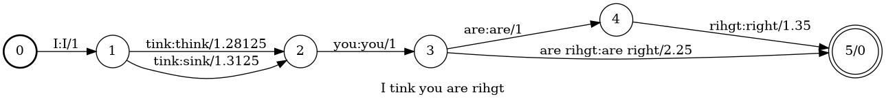

## Introduction

**What is analiticcl?**

* Analiticcl is a string-matching / fuzzy-matching system
* Intended for text normalisation like:
    * Diachronic variation
    * post-OCR/HTR variation
    * spelling correction (especially non-word errors)
* Lexicon-based; fuzzy lookups against a lexicon

## Introduction: Context

* Developed in the Golden Agents projects
* Builds upon prior research (Reynaert 2010; Reynaert 2004)

## Introduction: Implementation

* Built with performance and scalability in mind
    * Multi-threaded (parallellisation)
    * Written in Rust, compiles to native code
    * Low-level command-line tool and programming library
        * for Rust and for Python, via a binding
    * Unit/integration tests, CI, benchmarks
* Feature-rich
    * Highly parametrised
    * Flexible usage
* Source: https://github.com/proycon/analiticcl
* License: GNU GPLv3

## Installation

Download, compile and install:

``$ cargo install analiticcl``

and/or for the Python binding:

``$ pip install analiticcl``

## Fuzzy string matching

**Core function: Fuzzy string matching**

* Given a string, find the forms in the lexicon that are closest (**query** mode)
    * *error correction*
* Given a text, find corrections for arbitrary substrings in the text (**search** mode)
    * *error detection and correction*
* Given a lexicon entry, find close variants in the text (**learn** mode)

## Example: Query mode

\footnotesize
```
$ analiticcl query --interactive --lexicon examples/eng.aspell.lexicon \
                   --alphabet examples/simple.alphabet.tsv
Initializing model...
Loading lexicons...
Building model...
Computing anagram values for all items in the lexicon...
 - Found 119773 instances
Adding all instances to the index...
 - Found 108802 anagrams
Creating sorted secondary index...
Sorting secondary index...
 ...
Querying the model...
(accepting standard input; enter input to match, one per line)
seperate
seperate        separate        0.734375  \
                operate 0.6875 \
                desperate       0.6875   \
                temperate       0.6875          serrate 0.65625         separates       0.609375                separated       0.609375
```
\normalsize

## Variant matching: Naive approach

A naive approach to variant matching:

* Given $m$ input words
* Compute edit distance (levenshtein) between each input word to all words in the lexicon ($n$)
* High computational cost! *O(mn)*, and the levenshtein algorithm itself has already a $O(l)$ (l=length) time complexity.
    * Does not scale

## Variant matching: anagram hashing (1)

Anagram hashing (Reynaert 2010; Reynaert 2004) aims to drastically reduce the variant search space.

* Provides a fast *heuristic* for edit distance
* Analiticcl reimplements and improves upon the idea implemented in earlier tool TICCL

## Variant matching: anagram hashing (2)

An Anagram Value (AV)..

* is computed for each 'word' in the input and in the lexicon
* uniquely represents the combination of characters in the word (unordered)
    * $AV(east) = AV(seat) = AV(eats)$
* has compositional properties:
    * $AV(eat) \cdot AV(s) = AV(eats)$
    * $\frac{AV(eats)}{AV(s)} = AV(eat)$
* each anagram value can be unambiguously decomposed to all its constituents
* no collisions between anagrams guaranteed (in this reimplementation)
* anagrams themselves deliberately collide
* serves as the key in a hash map (stores the lexicon)

## Variant matching: hash function

Computation of the Anagram Value is simple composition of **prime** factors:

* **Input:** alphabet
* Each 'letter' in the alphabet is assigned a successive **prime number**, this is the Anagram Value of the 'letter'.
    * Example: $AV(a)=2, AV(b)=3, AV(c)=7, AV(d)=11, AV(e)=17$
    * The use of prime number guarantees no collisions between anagrams
    * Novel with respect to Reynaert's approach.
* Simple hashing function ($l$=length, $c_i$=character at index $i$):
    $$\prod_{i=0}^{l} AV(c_i)$$
* **Caveat:** May result in very large integers!
    * Exceeds 64-bit register
    * Requires an efficient big integer implementation

## Variant matching: Search (1)

**Loading stage**: Compute Anagram Index and secondary index

* Compute Anagram Value for each entry in the lexicon and store in a hash map (the anagram index)
* Mapping the anagram value to all instances of the anagram: $$AV(a,e,s,t) \mapsto [ east, seat, eats ]$$
* Compute a secondary index mapping to *sorted anagram values*: $$(n,|s|) \mapsto L$$
    * where $s$ is a string, $|s|$ its length in characters, and $n$ it's length in words/tokens
    * where $L$ is a *sorted* list of anagram values
    * example: $(1,4) \mapsto [ AV(a,e,s,t), ... ]$

## Variant matching: Search (2)

**Search stage**: Given a 'word' to correct:

* we compute the anagram value for the input
* we look up this anagram value in the anagram index (if it exists) and gather the variant candidates associated with the anagram value
* we compute all deletions within a certain distance (e.g. by removing any 2 characters).
    * Example with 1 character: $$del(AV(a,e,s,t)) = [ AV(a,e,s),AV(e,s,t),AV(a,s,t),AV(a,e,t) ]$$
    * This is an arithmetic operation on the anagram values (division)

## Variant matching: Search (3)

* For all of the anagram values resulting from these deletions we look which anagram values in our index *match or contain* the value under consideration. We again gather the candidates that result from all matches.
    * Match or contain: $AV_a$ contains $AV_b$ when $$AV_a \mod AV_b = 0$$.
    * To facilitate this lookup, we make use of the *secondary index*
    * Uses a binary search to find the anagrams that we should check our anagram value against (i.e. to check whether it is a subset of the anagram)
    * Prevents needing to exhaustively try all anagram values in our index.

## Variant matching: Search (4)

We have collected all possibly relevant variant instances: a considerably smaller set than the entire set we'd get if we
didn't have the anagram heuristic! Now the set is reduced we apply more conventional measures:

* We compute several similarity metrics between the input and the possible variants:
    * Damerau-Levenshtein
    * Longest common substring
    * Longest common prefix/suffix
    * Casing difference
* A score is computed that is a weighted linear combination of the above components
    * the actual weights are configurable.
    * an exact match always has score 1.0.
* A cut-off value prunes the list of candidates that score too low
* Optionally, if a confusable list was provided, we adjust the score for known confusables

## Feature: Confusable lists

* A list of *confusable patterns* with a weight
* Allows favouring or penalizing certain edits
* Example: OCR pattern: ``-[f]+[s]``
* Example: historical dutch pattern: ``-[uy]+[ui]`` (huys -> huis)
* Allows context matching
* Taken into account as part of the similarity score function

## Input and output

Analiticcl takes simple TSV files (tab separated values) as input:

* **Lexicon**
    * List of preferably validated words/multi-word expressions
    * May contain frequency information
* **Variant list:** explicitly relates variants to preferred forms.
    * Each variant carries a score expression how likely the variant maps to the preferred word
    * May also contain frequency information
    * **Error list**; a form of a variant lists where the variants are considered errors
    * Example: ``separate  seperate  1.0  seperete  1.0``
    * This is also the output form in *learn* mode
* **Language model**: for context-sensitive error detection/correction
* Multiple lexicon/variants lists supported
* Output is TSV or JSON

## Background lexicon

* Analiticcl depends greatly on the quality of your input (lexicons)
* A good background corpus is required (out of vocabulary problem)
* ..otherwise analiticcl will eagerly mismatch to words it does know

## Error Detection (1)

* In **Query** mode, input is a word/phrase you want to correct as a whole
* In **Search** mode, input is running text: analiticcl detects which
  parts of the input (words or higher order n-grams) need to be corrected.
* An additional and complex challenge!
* **N-grams**: consider splits and merges:
    * *thehouse* $\rightarrow$ *the house* , *teahouse* ?
    * *tea house* $\rightarrow$ *the house* , *teahouse* ?
* **Context** is often a determining factor

## Error Detection (2)

Given an input sentence:

1. Extract all segments of the input, i.e. all n-grams up until a certain order
2. Do variant lookup for each (like query mode)
3. Express all segments, their variants, their scores as transitions in a Finite State Transducer (FST)
    * Scores are expressed as costs
4. Extract the best path (lowest cost) with a beam search



## Error Detection (3)


* Scores are re-expressed as a cost (to be minimised)
* Base cost (integer) covers the number of input tokens spanned
    * establish a common ground for comparison between n-grams
    * n-grams compete
* Variant cost (fraction): inverse of the variant score: (0.0 best, approaching 1.0 as scores get worse)
    $$cost = 1 - score$$
* **Joint variant score**: Sum of all costs on a complete path.
* Extract the 'cheapest' path(s)

## Error Detection (4): Context

1. Extract the best $n$ solutions from the FST (e.g. $n=250$)
2. Compute the perplexity for each; using **Language Model**
3. Compute a weighted combined score of the perplexity and the joint variant score
    * Not trivial, strikes a balance between LM and variant model
    * Compute normalised joint variant score: $$variantscore_i = \ln(\frac{cost_{best}}{cost_{i}})$$
    * Compute normalised LM score: $$lmscore_{i} = \ln(\frac{PP_{best}}{PP_{i}})$$
    * Weighted geometric mean: $$score_{i} = \lambda_1 variantscore_{i} + \lambda_2 lmscore_{i}$$
4. Select the best scoring solution (minimize score)


